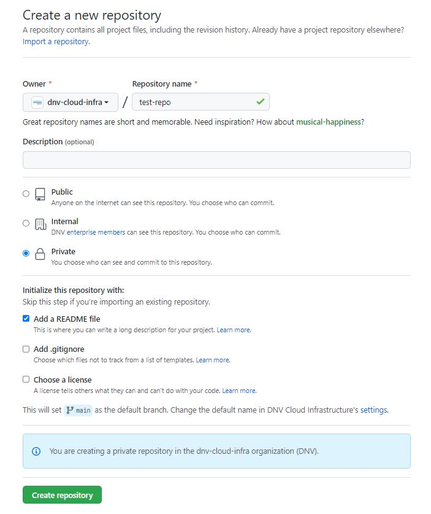
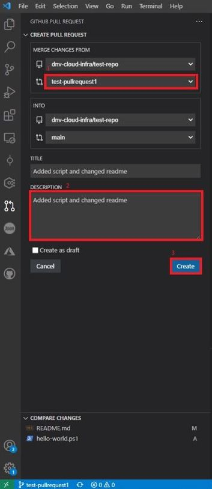

# DNV Cloud Infrastructure
This is the main Github Enterprise project for the Cloud Architecture team which is part of the GSS IT Cloud Infrastucture department in DNV.  
## Granting Access to this Project

If any colleagues require access to this project then a Github Enterprise license is required.  If the user already has a copy of <https://store.dnv.com/product/guardia/application/193> or <https://store.dnv.com/product/guardia/application/195> then you can proceed to the step below as Github Enterprise has a license included in both products.  Otherwise contact Thomas Schafer with the name of the user that require a Github Enterprise license and they can be purchased from Crayon for 138,49 NOK per month (around $16) when the license has been purchased then you can proceed to provision the user following the next step.

A personal Github account is also required before being able to access the project,  if the user doesn't have a personal github account then ask them to create one before proceeding.

### Provisioning a new user to the Project

Users are added/removed to/from the project using SCIM (System for Cross-domain Identity Management) provisioning,  ensure that the user has a license for Github Enterprise then add them to the group in our onprem AD "AppGlobal GitHub Cloud Infra" After around 60 minutes the user will receive an email at which point they can access the project via the link and connect their Github and work account, this configures SSO which is enforced for the project.
## Working with Github Repositories

This project has a repository named cloud-architecture which is used for all generic scripts, documentation and files,  any files that are for a specific project should be stored in that projects repository or a repository should be created as per the instructions below.

### Creating a Repository

> When creating a new repository it's currently not possible to have default branch settings configured at the project level which means that important important branch protection rules such as requiring pull requests before merging with the main branch need to be manually setup. These rules cannot be configured through vscode so until branch protection rules can be set at the project level repository creation will be done via the portal.

To create a new repository, in the repositories tab, click on "New Repository"

> The repository name should be seperated with hyphens and preferrably in lower case.

Enter the repository name and a description of the project.  

Select Private as the option for repository visibility,  this will only allow members of the Cloud Architecture team to view the repository.  If you would like the repository to be visible to any member of the DNV Github Enterprise then select Internal. Public repository creation is disabled for our project.

>Please note it's possible that Guest accounts in our Azure AD global tenant could also view repositories when the visibility is set to internal. 

Select "Add a READMEfile" in order to write a more detailed description of the project later.  

Optionally select "Add .gitignore" to omit certain files and directories from future commits.

Don't select "Choose a license" as Public repository creation is disabled.

Click on "Create Repository" to create the repository.

In order to ensure the main branch is updated in a controlled and secure manor then a branch protection rule needs to be created on new repositories in order to setup Pull Requests.
When created click on "Settings" then "Branches" then "Add rule"

For "Branch name pattern" use "main" to protect the main branch.

select "Require a pull request before merging"

It's recommended to keep require approvals checked particularly for production code however this can be unchecked for development work.

Click on "include administrators" then click on "Create" to create the rule.

Cloning a repository

Within the repository copy the HTTPS URL

In order to work with the newly created repository you will need to clone it locally via the VSCode command palette shortcut (Ctrl+Shift+P) type in ">git: clone" then pasting in the url copied from github in the previous step and clicking on "Clone from URL" in the dropdown box.

> If you have issues cloning the repository due to SSO errors then within windows credential manager remove all Git credentials,  when cloning you will then be asked to re-authenticate with Github after which your repository will be cloned as expected.

Browse to the location you wish to save the cloned repository and then click on "Select Repository Location"

### Branches and Pull Requests

First install the Github Pull Requests and Issues extension in VSCode <https://marketplace.visualstudio.com/items?itemName=GitHub.vscode-pull-request-github>

As Pull Requests were enabled on the new repository in order to update the main branch a new branch should be created,  when the changes have been merged with the new branch a pull request can be initiated through the Github Pull Requests and Issues extension.  Comments can then be made by reviewers and when satisfied the code can be merged with the main branch after which the branch should be deleted locally and remotely via the Github Pull Requests and Issues extension. 

To create a new branch, in the command palette (Ctrl+Shift+P) type in ">git:Create Branch"

Then enter the branch name::

Then initialize the repository using the command palette (Ctrl+Shift+P) by typing in >git: Initialize Repository.

When your changes have been commited to the new branch in order to merge these changes into the main branch a Pull Request needs to be created.  

To create a pull request using the command pallete enter the command >GitHub Pull Requests: Create Pull Request

> If the is your first time using this command you may need to login to your github account using the command palette (Ctrl+Shift+P) and entering the command >Github Pull Requests: Sign in to GitHub

Within the Create Pull Request pane ensure that the source branch is correct then add a description for the Pull Request then click on Create.

When created, the Pull Request is now in review mode where it's possible to add comments, labels, milestones, reviewers, assignees and close or merge the Pull Request.

When the files have been reviewed you can then move to Merging the Pull Request,  in this example "Squash and Merge" is used which "Creates a linear history by condensing the source branch commits into a single new commit on the target branch" Otherwise you can close the pull request by clicking on "Close Pull Request" 

Then click on "Create Merge Commit" to complete the Merge with the main branch.

Then click on "Delete Branch" and click on "OK" in the command palette in order to delete the feature branch locally and remotely.

